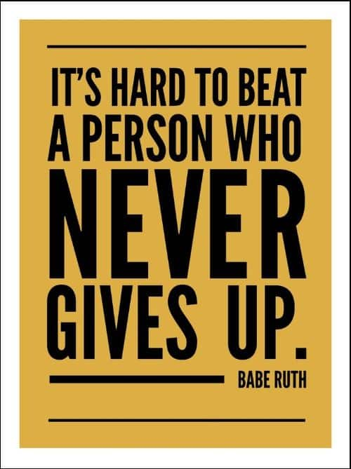

# SYLVESTER OPOKU
### THE SAVVY CODERS JOURNEY
#### THE FOLLOWING ARE MY GOALS FOR THIS COHORT:
- To develop my skills in visualization and building dashboards
- To better my data cleaning and wrangling skills via SQL and python
* To secure a job in the data analytics job market

#### PYTHON CODE ARTICLE THAT INTEREST ME
Below is my favorite article that I love to read 

https://betterprogramming.pub/10-great-articles-on-python-development-6f54dd38437f

#### MY INSPIRING PICTURE FOR THIS COHORT

#### WHY THIS IMAGE
Everyone in this world, at a point in time has either failed or is yet to fail. But what set people apart is what happens after the failure. Some give up and never wabts to continue. Few people decides to do otherwise and push through. It's hard to do it abd tha's why only few people are able to do that. I chose this image because I want to be a part of the few.